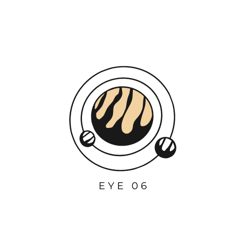
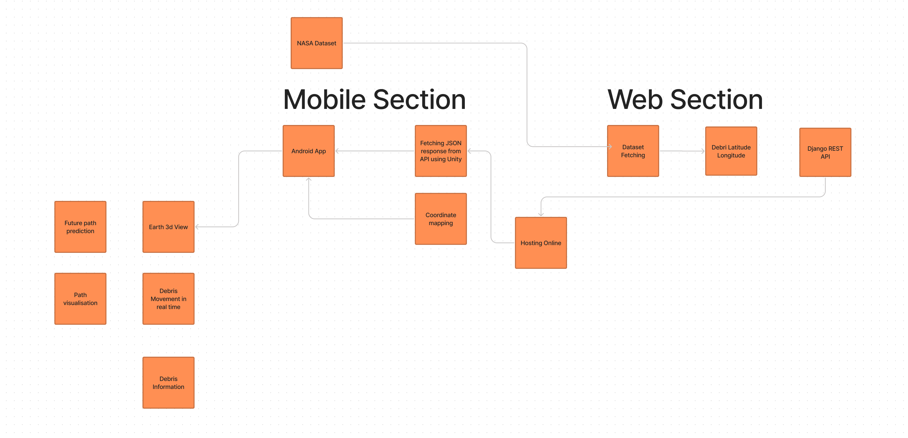

<!--
*** Thanks for checking out the Best-README-Template. If you have a suggestion
*** that would make this better, please fork the repo and create a pull request
*** or simply open an issue with the tag "enhancement".
*** Thanks again! Now go create something AMAZING! :D
***
***
***
*** To avoid retyping too much info. Do a search and replace for the following:
*** mamuncseru, 313, twitter_handle, shanto4045@gmail.com, 313, 313 is an geospatial application which is used to detect or monitor any known debris around the earth in real time 
-->

<!-- PROJECT SHIELDS -->
<!--
*** I'm using markdown "reference style" links for readability.
*** Reference links are enclosed in brackets [ ] instead of parentheses ( ).
*** See the bottom of this document for the declaration of the reference variables
*** for contributors-url, forks-url, etc. This is an optional, concise syntax you may use.
*** https://www.markdownguide.org/basic-syntax/#reference-style-links
-->
[![Contributors][contributors-shield]][contributors-url]
[![Forks][forks-shield]][forks-url]
[![Stargazers][stars-shield]][stars-url]
[![Issues][issues-shield]][issues-url]
[![MIT License][license-shield]][license-url]

<!-- PROJECT LOGO -->
 

  

  <h3 align="center">Eye06</h3>

  

    Eye06 is an geospatial application which is used to detect or monitor any known debris around the earth in real time!
     
    <a href="https://github.com/mamuncseru/313">
     
     
    <a href="https://github.com/mamuncseru/313">View Demo</a>
    ·
    <a href="https://github.com/mamuncseru/313/issues">Report Bug</a>
    ·
    <a href="https://github.com/mamuncseru/313/issues">Request Feature</a>
  

<!-- TABLE OF CONTENTS -->

  
<h2 style="display: inline-block">Table of Contents</h2>

  <ol>
    <li>
      <a href="#about-the-project">About The Project</a>
      <ul>
        <li><a href="#built-with">Built With</a></li>
      </ul>
    </li>
    <li>
      <a href="#getting-started">Getting Started</a>
      <ul>
        <li><a href="#prerequisites">Prerequisites</a></li>
        <li><a href="#installation">Installation</a></li>
      </ul>
    </li>
    <li><a href="#usage">Usage</a></li>
    <li><a href="#overview">Overview</a></li>
    <li><a href="#license">License</a></li>
    <li><a href="#acknowledgements">Acknowledgements</a></li>
  </ol>

<!-- ABOUT THE PROJECT -->
## About The Project

Real time space trash monitoring application which allows the user to have an amazing experience of seeing the space debris moving around our beloved Earth.

We've used space debris dataset from Celestrak to collect information about the debris from TLE files and used Heroku to pass the processed data to the front-end, Unity3d to display the data in an elegant way. Look at <a href="#overview">Overview</a> for a detailed explanation on how this works.

Anyone with the app can have the exact information with just a few clicks rather then getting lost in huge dataset full scientific numbers.

### Built With

* [Django](https://www.djangoproject.com)
* [Unity](https://unity.com)
* [Figma](https://www.figma.com)
* [Herouku](https://www.heroku.com)
* [Skyfield](https://rhodesmill.org/skyfield/)
* [Celstrack](https://celestrak.com)
* [Coordinate Mapper (unity library)](https://assetstore.unity.com/packages/templates/systems/coordinate-mapper-177904)
* [SimpleJSON](https://github.com/HenrikPoulsen/SimpleJSON)

<!-- OVERVIEW-->
## Overview
This is how the application works:

We are fetching all the debris TLE dataset from Celestrak using a python library called "Skyfield" which runs above sgp4 library and calculating latitude, longitude, altitude along with other crucial information of debris and storing them in a JSON format. After that we are using a REST API and deploying them on Heroku web server so that we can get real time data anytime we want. We used Unity3D engine to fetch those JSON data in real-time and visualize them by using coordinate mapper.

Now, We can see real time debris moving around the earth and by clicking individual debris we get there additional information such as latitude, longitude, elevation, name, no of total debris and much more. Our unique feature will allow users to predict the future path of the debris in a very convenient way as well. Interactivity and usability is our selling point.

<!-- LICENSE -->
## License

Distributed under the MIT License. See `LICENSE` for more information.

<!-- ACKNOWLEDGEMENTS -->
## Acknowledgements

* [CelesTrak](https://celestrak.com) for providing space debris dataset.

<!-- MARKDOWN LINKS & IMAGES -->
<!-- https://www.markdownguide.org/basic-syntax/#reference-style-links -->
[contributors-shield]: https://img.shields.io/github/contributors/mamuncseru/313.svg?style=for-the-badge
[contributors-url]: https://github.com/mamuncseru/313/graphs/contributors
[forks-shield]: https://img.shields.io/github/forks/mamuncseru/313.svg?style=for-the-badge
[forks-url]: https://github.com/mamuncseru/313/network/members
[stars-shield]: https://img.shields.io/github/stars/mamuncseru/313.svg?style=for-the-badge
[stars-url]: https://github.com/mamuncseru/313/stargazers
[issues-shield]: https://img.shields.io/github/issues/mamuncseru/313.svg?style=for-the-badge
[issues-url]: https://github.com/mamuncseru/313/issues
[license-shield]: https://img.shields.io/github/license/mamuncseru/313.svg?style=for-the-badge
[license-url]: https://github.com/mamuncseru/313/blob/master/LICENSE
[linkedin-shield]: https://img.shields.io/badge/-LinkedIn-black.svg?style=for-the-badge&logo=linkedin&colorB=555
[linkedin-url]: https://linkedin.com/in/mamuncseru
