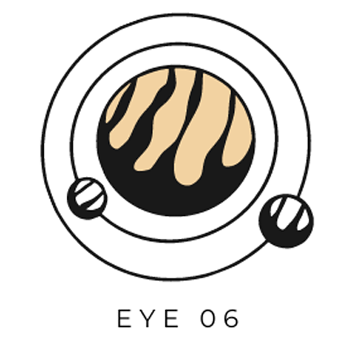

<!--
*** Thanks for checking out the Best-README-Template. If you have a suggestion
*** that would make this better, please fork the repo and create a pull request
*** or simply open an issue with the tag "enhancement".
*** Thanks again! Now go create something AMAZING! :D
***
***
***
*** To avoid retyping too much info. Do a search and replace for the following:
*** MIShanto, Eye06, twitter_handle, shanto4045@gmail.com, Eye06, Eye06 is an geospatial application which is used to detect or monitor any known debris around the earth in real time 
-->


<!-- PROJECT SHIELDS -->
<!--
*** I'm using markdown "reference style" links for readability.
*** Reference links are enclosed in brackets [ ] instead of parentheses ( ).
*** See the bottom of this document for the declaration of the reference variables
*** for contributors-url, forks-url, etc. This is an optional, concise syntax you may use.
*** https://www.markdownguide.org/basic-syntax/#reference-style-links
-->
[![Contributors][contributors-shield]][contributors-url]
[![Forks][forks-shield]][forks-url]
[![Stargazers][stars-shield]][stars-url]
[![Issues][issues-shield]][issues-url]
[![MIT License][license-shield]][license-url]


<!-- PROJECT LOGO -->
<br />
<p align="center">
  <a href="https://github.com/MIShanto/Eye06">
    
  </a>

  <h3 align="center">Eye06</h3>

  <p align="center">
    Eye06 is an geospatial application which is used to detect or monitor any known debris around the earth in real time!
    <br />
    <a href="https://github.com/MIShanto/Eye06"><strong>Explore the docs »</strong></a>
    <br />
    <br />
    <a href="https://github.com/MIShanto/Eye06">View Demo</a>
    ·
    <a href="https://github.com/MIShanto/Eye06/issues">Report Bug</a>
    ·
    <a href="https://github.com/MIShanto/Eye06/issues">Request Feature</a>
  </p>
</p>


<!-- TABLE OF CONTENTS -->
<details open="open">
  <summary><h2 style="display: inline-block">Table of Contents</h2></summary>
  <ol>
    <li>
      <a href="#about-the-project">About The Project</a>
      <ul>
        <li><a href="#built-with">Built With</a></li>
      </ul>
    </li>
    <li>
      <a href="#getting-started">Getting Started</a>
      <ul>
        <li><a href="#prerequisites">Prerequisites</a></li>
        <li><a href="#installation">Installation</a></li>
      </ul>
    </li>
    <li><a href="#usage">Usage</a></li>
    <li><a href="#overview">Overview</a></li>
    <li><a href="#license">License</a></li>
    <li><a href="#acknowledgements">Acknowledgements</a></li>
  </ol>
</details>


<!-- ABOUT THE PROJECT -->
## About The Project


Real time space trash monitoring application which allows the user to have an amazing experience of seeing the space debris moving around our beloved earth.

We've used NASA dataset to collect information about the debris and portrayed them into the frontend.

Anyone with the app can have the exact information with just a few clicks rather then getting lost in huge dataset numbers.


### Built With

* [Django](https://www.djangoproject.com)
* [Unity](https://unity.com)
* [Figma](https://www.figma.com)


<!-- GETTING STARTED -->
## Getting Started

To get a local copy up and running follow these simple steps.

### Prerequisites

* Unity 3D
* A browser compatible with WebGL 

### Installation

1. Clone the repo
   ```sh
   git clone https://github.com/MIShanto/Eye06.git
   ```
2. Install NPM packages
   ```sh
   npm install
   ```


<!-- USAGE EXAMPLES -->
## Usage

Use this space to show useful examples of how a project can be used. Additional screenshots, code examples and demos work well in this space. You may also link to more resources.

_For more examples, please refer to the [Documentation](https://example.com)_


<!-- ROADMAP -->
## Overview
This is how the application works:


<!-- LICENSE -->
## License

Distributed under the MIT License. See `LICENSE` for more information.


<!-- ACKNOWLEDGEMENTS -->
## Acknowledgements

* [CelesTrak](https://celestrak.com) for providing space debris dataset.


<!-- MARKDOWN LINKS & IMAGES -->
<!-- https://www.markdownguide.org/basic-syntax/#reference-style-links -->
[contributors-shield]: https://img.shields.io/github/contributors/MIShanto/Eye06.svg?style=for-the-badge
[contributors-url]: https://github.com/MIShanto/Eye06/graphs/contributors
[forks-shield]: https://img.shields.io/github/forks/MIShanto/Eye06.svg?style=for-the-badge
[forks-url]: https://github.com/MIShanto/Eye06/network/members
[stars-shield]: https://img.shields.io/github/stars/MIShanto/Eye06.svg?style=for-the-badge
[stars-url]: https://github.com/MIShanto/Eye06/stargazers
[issues-shield]: https://img.shields.io/github/issues/MIShanto/Eye06.svg?style=for-the-badge
[issues-url]: https://github.com/MIShanto/Eye06/issues
[license-shield]: https://img.shields.io/github/license/MIShanto/Eye06.svg?style=for-the-badge
[license-url]: https://github.com/MIShanto/Eye06/blob/master/LICENSE
[linkedin-shield]: https://img.shields.io/badge/-LinkedIn-black.svg?style=for-the-badge&logo=linkedin&colorB=555
[linkedin-url]: https://linkedin.com/in/MIShanto
